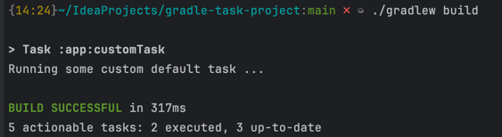

## Project Structure

This repository contains the basic project structure to use when in need of Java classes code usage in Gradle custom
tasks.

## Requirements for the thing to work

* The following project structure must be used. The `buildSrc` folder must be present in the root of the project.

```groovy
gradle-project
├── app
│   ├── build.gradle
│   └── src             // some java code
│       └── ...
├── buildSrc
│   ├── build.gradle
│   ├── settings.gradle
│   └── src             // common build logic
│       └── ...
├── settings.gradle
├── gradle
├── gradlew
└── gradlew.bat
```

* The `buildSrc` should contain the task logic. In our case - `CustomGradleTask.java`. The logic may be split into
  multiple classes. The task in real life will probably be much more complex - check Gradle documentation for more
  information.

```java
import org.gradle.api.DefaultTask;
import org.gradle.api.tasks.TaskAction;

public abstract class CustomGradleTask extends DefaultTask {

    @TaskAction
    public void run() {
        System.out.println("Running some custom default task ...");
    }
}
```

* The `app` module (or the module where your task has to be applied) should contain the `build.gradle` file with the
  following content. The dependency on build or any other task should be defined here.

```groovy
plugins {
    id 'java'
}

group = 'org.studies'
version = '1.0-SNAPSHOT'

tasks.register('customTask', CustomGradleTask) {
}

tasks.build.dependsOn(customTask)

repositories {
    mavenCentral()
}

dependencies {
    testImplementation platform('org.junit:junit-bom:5.10.0')
    testImplementation 'org.junit.jupiter:junit-jupiter'
}

test {
    useJUnitPlatform()
}
```

If I now run `build`, I'll see the output of the custom task.

```shell
$ ./gradlew build
``` 



## Sources

* Gradle Docs: https://docs.gradle.org/current/userguide/custom_tasks.html
* [mihailaleksseev](https://github.com/mihailaleksseev/conferenceAbstracts/blob/main/%2B%2B%202013%20Gradle%20%7C%20%D0%95%D0%B2%D0%B3%D0%B5%D0%BD%D0%B8%D0%B8%CC%86%20%D0%91%D0%BE%D1%80%D0%B8%D1%81%D0%BE%D0%B2%20%E2%80%94%20Power%20of%20Gradle.pdf)
* [Евгений Борисов — Power of Gradle](https://youtu.be/NZJTYPLb0iE?si=-kejgAShSME-R4yM&t=2916)
